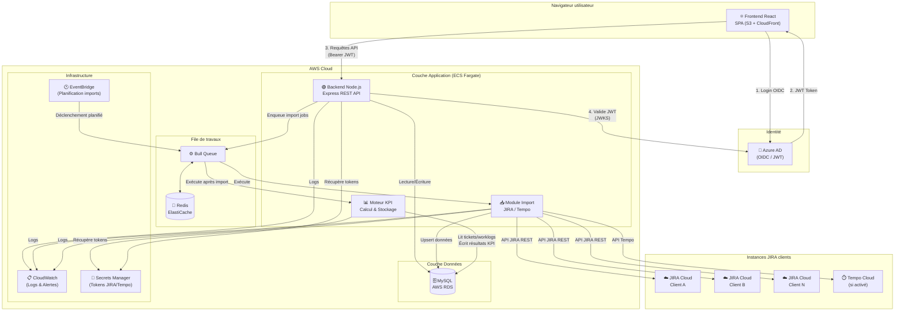

# Architecture globale — Portail KPI Productivité

> **Version** : 1.3
> **Étape** : 2 — Architecture technique
> **Statut** : À valider

---

## Sommaire

1. [Vue d'ensemble](#1-vue-densemble)
2. [Diagramme d'architecture](#2-diagramme-darchitecture)
3. [Description des composants](#3-description-des-composants)
4. [Choix technologiques détaillés](#4-choix-technologiques-détaillés)
5. [Décisions architecturales clés](#5-décisions-architecturales-clés) _(DA-001 → DA-008)_
6. [Environnements](#6-environnements)

---

## 1. Vue d'ensemble

L'application est composée de cinq grands blocs fonctionnels :

| Bloc | Rôle |
|------|------|
| **Frontend SPA** | Interface utilisateur React, consomme l'API REST du backend |
| **Backend REST API** | Serveur Node.js, orchestre la logique métier, expose les endpoints |
| **Module d'import** | Jobs Node.js, récupère les données JIRA / Tempo et les stocke en base |
| **Moteur KPI** | Calcule et stocke les résultats KPI après chaque import |
| **Base de données** | MySQL (AWS RDS), source de vérité unique pour toutes les données |

L'authentification est déléguée à **Azure AD** (OIDC / OAuth 2.0). Le backend ne stocke pas de mots de passe — il valide les tokens JWT émis par Azure AD.

---

## 2. Diagramme d'architecture



---

## 3. Description des composants

### 3.1 Frontend (React SPA)

**Rôle :** Interface utilisateur unique, rendue côté client.

**Responsabilités :**
- Authentification via le flux OIDC Azure AD (MSAL.js)
- Stockage du token JWT en mémoire (pas de localStorage pour la sécurité)
- Appels API REST vers le backend avec le token Bearer
- Affichage des dashboards KPI, graphiques d'évolution, tableaux
- Interfaces d'administration (configuration clients, KPI, imports, utilisateurs)
- Export CSV / Excel / PDF côté client ou via endpoint dédié

**Déploiement :** Bundle statique hébergé sur AWS S3, distribué via AWS CloudFront (CDN).

---

### 3.2 Backend (Node.js Express REST API)

**Rôle :** Serveur applicatif central, point d'entrée unique pour le frontend.

**Responsabilités :**
- Validation des tokens JWT Azure AD (middleware d'authentification)
- Application des règles d'autorisation par rôle (RBAC)
- Exposition des endpoints REST pour le dashboard, la configuration et l'administration
- Enqueue des jobs d'import dans la file Bull
- Lecture des résultats KPI précalculés en base
- Génération des exports (CSV, Excel, PDF)

**Déploiement :** Container Docker sur AWS ECS Fargate (scalable horizontalement).

---

### 3.3 Module d'import (Worker Node.js)

**Rôle :** Récupère les données depuis les APIs JIRA Cloud et Tempo Cloud, les stocke en base interne.

**Responsabilités :**
- Consomme les jobs d'import depuis la file Bull
- Récupération des issues JIRA (pagination, retry, rate limiting)
- Récupération des worklogs JIRA natifs et / ou Tempo
- Récupération des membres de projet (synchronisation équipes)
- Récupération des entités de regroupement (Epics, Composants, Labels, etc.)
- Upsert des données en base MySQL
- Mise à jour du statut du job d'import
- Publication d'un événement "import terminé" → déclenchement du moteur KPI

**Déploiement :** Même container que le backend (worker séparé dans le même process) ou container dédié selon la charge.

---

### 3.4 Moteur KPI (Worker Node.js)

**Rôle :** Calcule les résultats KPI et les stocke en base après chaque import.

**Responsabilités :**
- Consomme les événements "import terminé" depuis la file Bull
- Pour chaque KPI actif d'un client : résout la configuration finale, sélectionne le calculator, exécute, stocke
- Marque les résultats obsolètes si la configuration a changé depuis le dernier calcul

**Déploiement :** Même cluster ECS que le backend, container ou processus worker dédié.

---

#### 3.4.1 Pattern Strategy — extensibilité des formules KPI

Le moteur KPI est structuré autour d'un **pattern Strategy** : chaque type de formule est encapsulé dans une classe indépendante implémentant une interface commune. Ajouter, corriger ou adapter une formule se fait en modifiant **un seul fichier**, sans toucher au reste du moteur.

**Interface `KpiCalculator` :**

```typescript
// src/engine/calculators/KpiCalculator.ts
interface KpiCalculator {
  calculate(
    issues:  Issue[],          // tickets filtrés pour ce client/période
    config:  FinalKpiConfig,   // config finale fusionnée (base + override client)
    context: CalculationContext // client, période, user, connexion DB
  ): Promise<KpiCalculationResult>;
}

interface KpiCalculationResult {
  value:                number;  // valeur calculée du KPI
  ticketCount:          number;  // tickets pris en compte
  excludedTicketCount:  number;  // tickets exclus (et pourquoi)
  excludedTicketDetails: ExcludedTicket[];
}
```

**Structure des calculators (`src/engine/calculators/`) :**

```
src/engine/calculators/
├── KpiCalculator.ts              ← interface + types partagés
├── registry.ts                   ← CalculatorRegistry : predefined_type → instance
├── predefined/
│   ├── RatioEstimeConsomme.ts    ← KPI "Respect des charges"
│   ├── RatioRetours.ts           ← KPI "Qualité (retours)"
│   ├── CountByStatus.ts          ← Comptage par statut
│   ├── CountWithoutEstimate.ts   ← Tickets sans estimation
│   ├── CountWithAi.ts            ← Tickets développés avec IA
│   ├── SumField.ts               ← Somme d'un champ numérique
│   └── AvgField.ts               ← Moyenne d'un champ numérique
├── jql/
│   └── JqlCalculator.ts          ← Traduction JQL → SQL local + agrégation
└── sql/
    └── SqlCalculator.ts          ← Exécution SQL en lecture seule (sandbox)
```

**Résolution de la configuration finale (config merge) :**

Avant tout calcul, le moteur fusionne `kpi_definitions.base_config` et `kpi_client_configs.config_override` via un **deep merge**, les valeurs du client override prenant priorité :

```typescript
// src/engine/configResolver.ts
const finalConfig: FinalKpiConfig = deepMerge(
  kpiDefinition.baseConfig,        // valeurs par défaut définies sur le KPI
  kpiClientConfig.configOverride   // surcharges spécifiques à ce client
);
```

**Résolution du calculator à exécuter :**

```typescript
// src/engine/engine.ts — logique de dispatch
if (kpiClientConfig.formulaOverride) {
  // L'admin a défini un SQL de remplacement pour ce (KPI × client) :
  // on court-circuite le calculator prédéfini et on exécute ce SQL directement
  return sqlCalculator.runOverride(kpiClientConfig.formulaOverride, context);
}

switch (kpiDefinition.formulaType) {
  case 'FORMULA_AST':
    return formulaAstCalculator.calculate(kpiDefinition.formulaAst, context);
  case 'JQL':
    return jqlCalculator.calculate(kpiDefinition.baseConfig.jql, finalConfig, context);
  case 'SQL':
    return sqlCalculator.calculate(kpiDefinition.baseConfig.sql, finalConfig, context);
}
```

**Ce que ce pattern garantit en pratique :**

| Besoin | Où intervenir | Impact |
|--------|--------------|--------|
| Corriger une formule | Éditer l'AST directement dans l'UI | Aucun code |
| Ajouter un nouveau type de formule prédéfinie | Nouveau fichier dans `predefined/` + entrée dans `registry.ts` | 2 fichiers |
| Modifier un paramètre de calcul pour un client | Champ `config_override` en base (JSON) | Zéro code |
| Corriger le moteur JQL → SQL | `JqlCalculator.ts` | Aucun calculator prédéfini touché |

---

### 3.5 File de travaux (Bull + Redis)

**Rôle :** Orchestration asynchrone des jobs d'import et de calcul KPI.

**Responsabilités :**
- File persistante pour les jobs d'import (incrémental, backfill, planifié)
- Garantie d'exécution : au moins une fois (`at-least-once`)
- Mutex par client (un seul import simultané par client)
- Retry automatique avec backoff configurable
- Visibilité de l'état des jobs (en attente, en cours, terminé, échoué)

**Technologie :** [Bull](https://github.com/OptimalBits/bull) (Node.js) + Redis (AWS ElastiCache).

---

### 3.6 Base de données (MySQL — AWS RDS)

**Rôle :** Source de vérité unique. Stocke toutes les données applicatives.

**Caractéristiques :**
- MySQL 8.0, moteur InnoDB, charset `utf8mb4`
- AWS RDS Multi-AZ pour la haute disponibilité en production
- Chiffrement au repos activé (AWS KMS)
- Sauvegardes automatiques (7 jours de rétention minimum)
- Connection pooling côté backend (via Sequelize ou Prisma)

---

### 3.7 Gestion des secrets (AWS Secrets Manager)

**Rôle :** Stockage sécurisé des tokens JIRA et Tempo. Les tokens ne sont jamais stockés en clair en base de données.

**Fonctionnement :**
- Chaque client dispose d'un secret dans AWS Secrets Manager (token JIRA + token Tempo si applicable)
- L'ARN du secret est stocké en base (table `clients`)
- Le module d'import récupère le token au moment de l'appel API
- Rotation des secrets possible sans modification du code

---

### 3.8 Planification (AWS EventBridge)

**Rôle :** Déclenche les imports planifiés selon le calendrier configuré.

**Fonctionnement :**
- Une règle EventBridge par fréquence d'import (ex. : `cron(0 2 * * ? *)` pour 2h du matin)
- Appelle un endpoint interne du backend (ou Lambda légère) pour enqueuer les jobs planifiés
- Alternatif simple en v1 : `node-cron` dans le backend avec la même logique

---

### 3.9 Observabilité (AWS CloudWatch)

**Rôle :** Logs centralisés, métriques et alertes.

**Ce qui est tracé :**
- Logs structurés (JSON) de tous les composants (niveau : INFO / WARN / ERROR)
- Métriques custom : durée des imports, nombre d'erreurs, latence API
- Alertes CloudWatch sur les échecs d'import et les erreurs critiques

---

## 4. Choix technologiques détaillés

### Frontend

| Technologie | Rôle | Justification |
|-------------|------|---------------|
| React 18 | Framework UI | Choix exprimé |
| TypeScript | Typage statique | Maintenabilité à long terme |
| React Router v6 | Navigation SPA | Standard React |
| TanStack Query | Fetching & cache | Gestion du cache API côté client |
| Zustand | State management | Léger, simple, adapté à la taille du projet |
| Recharts | Graphiques | Léger, basé SVG, bon support React |
| TanStack Table | Tableaux de données | Performant sur grands volumes |
| Ant Design (AntD) | UI Components | Riche, adapté aux interfaces métier, accessible |
| MSAL.js v3 | Auth Azure AD | Bibliothèque officielle Microsoft pour OIDC |
| ExcelJS + jsPDF | Export Excel / PDF | Génération côté client |

### Backend

| Technologie | Rôle | Justification |
|-------------|------|---------------|
| Node.js 20 LTS | Runtime | Choix exprimé |
| TypeScript | Typage statique | Cohérence avec le frontend |
| Express.js | Framework HTTP | Mature, large écosystème |
| Prisma | ORM MySQL | Type-safe, migrations intégrées, excellent DX |
| Bull v4 | Queue de jobs | Robuste, Redis-backed, monitoring intégré |
| jsonwebtoken + jwks-rsa | Validation JWT | Validation des tokens Azure AD |
| Axios | Client HTTP | Appels API JIRA / Tempo |
| Winston | Logging | Logs structurés JSON |
| Zod | Validation des entrées | Validation des requêtes API |

### Infrastructure AWS

| Service | Rôle |
|---------|------|
| ECS Fargate | Hébergement des containers backend / workers |
| ECR | Registry Docker |
| RDS MySQL 8.0 | Base de données (Multi-AZ en prod) |
| ElastiCache Redis | File Bull + cache applicatif |
| S3 + CloudFront | Hébergement frontend SPA |
| Secrets Manager | Tokens JIRA / Tempo |
| EventBridge | Planification des imports |
| CloudWatch | Logs, métriques, alertes |
| VPC | Isolation réseau (backend, BDD, cache en subnet privé) |
| ALB | Load balancer pour le backend |
| Route 53 | DNS |
| ACM | Certificats TLS |

---

## 5. Décisions architecturales clés

### DA-001 — Données JIRA stockées en base interne, aucun appel JIRA en temps réel depuis le dashboard

**Décision :** Le frontend consomme uniquement les données de la base MySQL. Aucun appel à l'API JIRA n'est fait lors de la consultation du dashboard.

**Avantages :** Performance, indépendance vis-à-vis des disponibilités JIRA, possibilité de calculs complexes en SQL, pas de dépassement de quota API JIRA lors des consultations.

**Contrainte :** Les données affichées ont un décalage correspondant au dernier import réussi.

---

### DA-002 — Résultats KPI précalculés, jamais calculés à la volée

**Décision :** Les KPI sont calculés après chaque import et stockés dans `kpi_results`. Le dashboard lit uniquement les résultats préexistants.

**Avantages :** Réponses instantanées (requêtes simples en base), cohérence des résultats (les données ne changent pas entre deux imports), possibilité d'historiser les résultats.

**Contrainte :** Si la configuration d'un KPI change, les anciens résultats sont marqués obsolètes jusqu'au prochain recalcul.

---

### DA-003 — Authentification stateless via JWT Azure AD

**Décision :** Le backend ne maintient pas de session serveur. Chaque requête contient un JWT Azure AD validé à la volée via les clés publiques JWKS.

**Avantages :** Scalabilité horizontale du backend (pas de session partagée), simplicité d'architecture, sécurité assurée par Azure AD.

**Contrainte :** La révocation d'un token n'est effective qu'à son expiration (mitigé par une durée de vie courte du token : 1h).

---

### DA-004 — Tokens JIRA / Tempo gérés via `jira_connections` (et AWS Secrets Manager en prod)

**Décision :** Les credentials d'accès JIRA (URL, email, token) sont centralisés dans la table `jira_connections`, qui est une entité autonome partageable entre plusieurs clients. Un même token peut donc servir N clients sans duplication.

- **En développement :** le token est stocké en clair dans `jira_connections.jira_api_token`.
- **En production :** `jira_api_token` contient l'ARN du secret AWS Secrets Manager ; le module d'import résout la valeur réelle à l'exécution.

**Avantages :** Évite la duplication des credentials pour les projets d'une même instance JIRA, rotation des tokens sans modifier la configuration de chaque client, audit des accès centralisé.

**Isolation des données :** la séparation entre clients partageant la même connexion est assurée par le champ `jql_filter` sur chaque client (voir DA-009).

---

### DA-009 — Isolation des données par `jql_filter` (NEW)

**Décision :** Quand plusieurs clients utilisent la même instance JIRA, chaque client porte un filtre JQL persistant (`clients.jql_filter`, ex. : `project = MYPROJ`) qui scope strictement ses imports.

**Règle d'application :** lors de chaque import, le JQL effectif est `client.jqlFilter` (base) + éventuel override manuel passé au déclenchement. Ce mécanisme garantit qu'un ticket du projet A n'est jamais importé dans le contexte du client B.

**Avantages :** Flexibilité maximale (JQL complet, pas seulement un projectKey), configurable sans déploiement, visible et modifiable par les managers depuis la page Imports.

---

### DA-005 — Mutex par client pour les imports (Bull)

**Décision :** Un seul import peut s'exécuter simultanément par client. Bull garantit l'exclusion mutuelle via son système de concurrence par queue.

**Avantages :** Évite les imports parallèles qui généreraient des conflits d'upsert et des doublons de worklogs.

---

### DA-006 — Entité de regroupement générique (non liée à Epic)

**Décision :** Le niveau de consolidation pour les KPI Chef de projet est configurable par client (Epic, Composant, Label, Version, Champ custom). L'entité `grouping_entities` est générique.

**Avantages :** Flexibilité pour les clients n'utilisant pas les Epics, évolutivité sans modification du modèle de données.

---

### DA-008 — Pattern Strategy pour le moteur KPI : une classe par type de formule

**Décision :** Le moteur KPI est structuré selon un pattern Strategy. Chaque `predefined_type` est implémenté dans un fichier indépendant (`src/engine/calculators/predefined/`). Le moteur dispatche vers le bon calculator via un `CalculatorRegistry`. La configuration finale est obtenue par deep merge `base_config` + `config_override`, le client gagnant les conflits. Un champ `formula_override` (SQL) sur `kpi_client_configs` permet de remplacer intégralement la logique prédéfinie pour un (KPI × client) donné, sans déploiement.

**Avantages :**
- Corriger ou adapter une formule = modifier un seul fichier ciblé, sans risque de régression sur les autres KPI
- Ajouter un nouveau type de KPI = ajouter un fichier + une entrée dans le registry
- Surcharge zero-code par client via `config_override` (JSON) ou `formula_override` (SQL)
- Chaque calculator est indépendamment testable

**Contrainte :** `formula_override` contient du SQL en clair en base — il doit être protégé par les mêmes contrôles que le mode SQL libre (lecture seule, timeout, audit de modification).

---

### DA-007 — Type de projet JIRA (Classic / Next-gen) configuré explicitement par projet

**Décision :** L'Admin configure manuellement le type de chaque projet JIRA lors de la configuration client. Ce choix détermine le champ utilisé pour récupérer le lien Epic → ticket lors de l'import.

**Avantages :** Simplicité d'implémentation, contrôle explicite.

**Contrainte :** L'Admin doit connaître le type de projet JIRA utilisé par le client.

---

## 6. Environnements

| Environnement | Infrastructure | Base de données | Notes |
|---------------|---------------|-----------------|-------|
| **Local (dev)** | Docker Compose (Node.js + MySQL + Redis) | MySQL local | Pas d'AWS, JIRA mocké ou instance sandbox |
| **Dev (AWS)** | ECS Fargate (petite taille) | RDS MySQL (single-AZ) | Déploiement automatique sur merge `develop` |
| **Staging** | ECS Fargate | RDS MySQL (single-AZ) | Données de test, proche de la prod |
| **Production** | ECS Fargate (auto-scaling) | RDS MySQL (Multi-AZ) | Déploiement manuel validé |

### Docker Compose local (résumé)

```yaml
services:
  backend:       # Node.js Express
  worker:        # Bull worker (import + KPI engine)
  mysql:         # MySQL 8.0
  redis:         # Redis 7
  frontend:      # React dev server (Vite)
```
