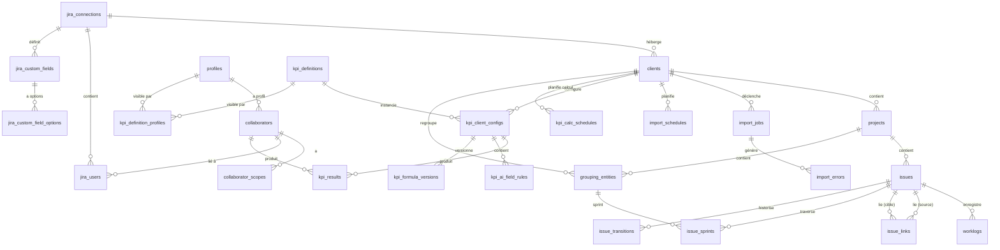
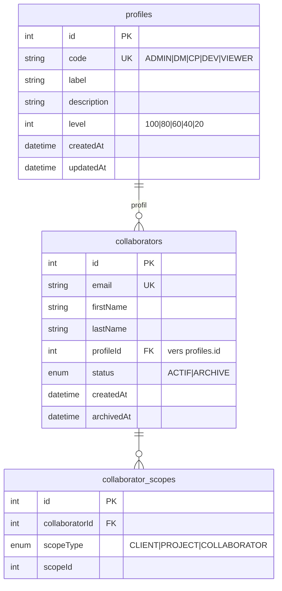
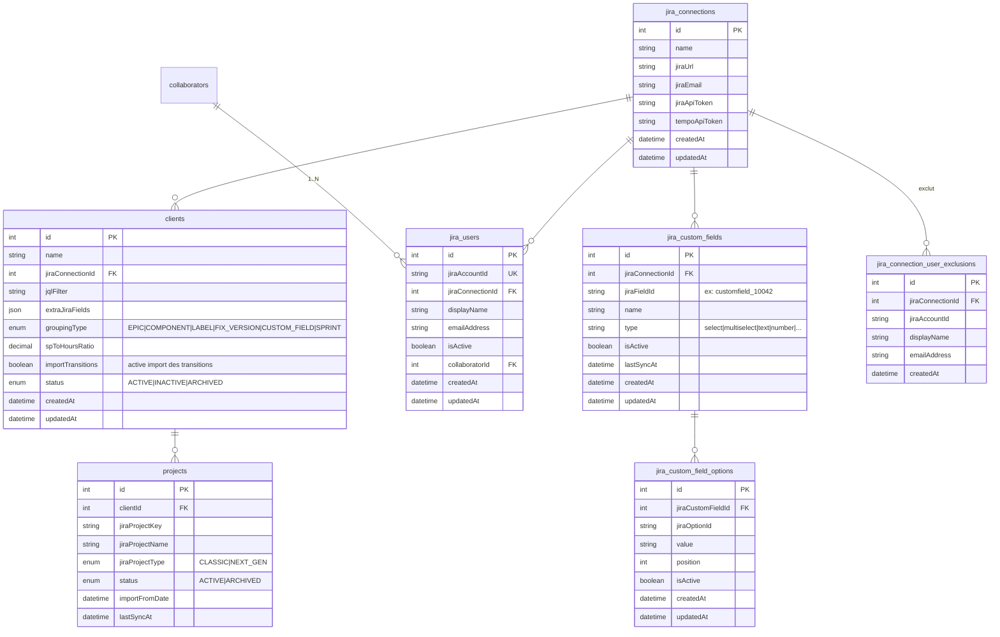
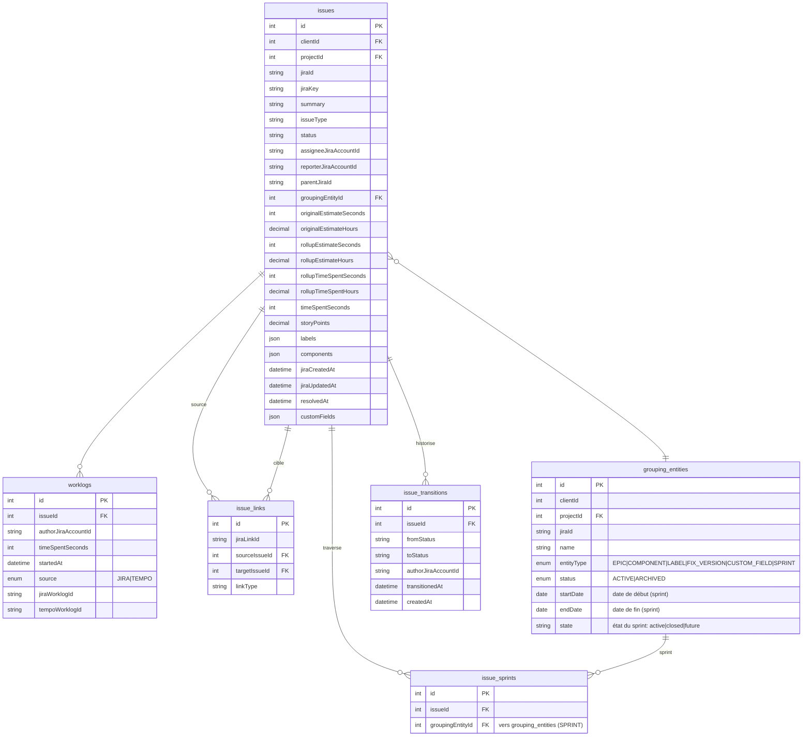
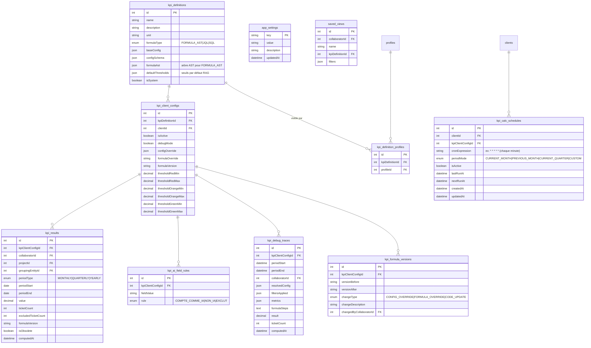
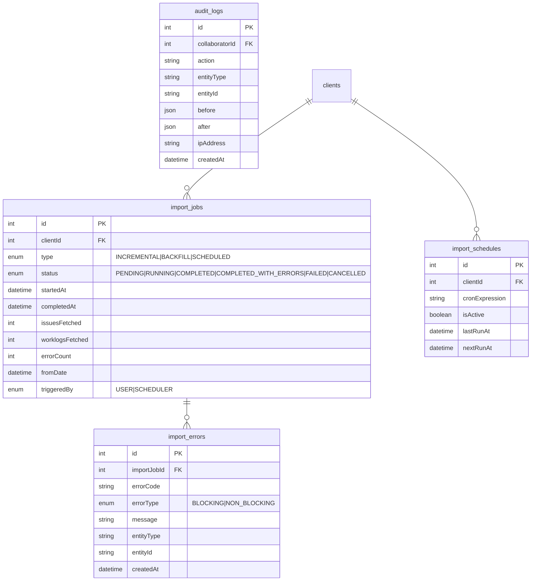

# Modèle de données — Portail KPI Productivité

> **Version** : 4.0
> **Étape** : 2 — Architecture technique
> **Dernière mise à jour** : 2026-03-16
> **Statut** : En production (dev)

---

## Sommaire

1. [Vue d'ensemble des domaines](#1-vue-densemble-des-domaines)
2. [Diagramme ER global](#2-diagramme-er-global)
3. [Diagramme ER par domaine](#3-diagramme-er-par-domaine)
4. [Description détaillée des entités](#4-description-détaillée-des-entités)
5. [Isolation multi-tenant](#5-isolation-multi-tenant)
6. [Règles métier importantes](#6-règles-métier-importantes)
7. [Moteur Formula AST](#7-moteur-formula-ast)
8. [Profils dynamiques et scoping](#8-profils-dynamiques-et-scoping)

---

## 1. Vue d'ensemble des domaines

Le modèle est organisé en six domaines fonctionnels autour d'une architecture **multi-tenant** : plusieurs instances JIRA peuvent injecter leurs données dans une base commune sans collision.

| Domaine | Entités principales | Description |
|---|---|---|
| **Profils & Collaborateurs** | `profiles`, `collaborators`, `collaborator_scopes` | Profils dynamiques (table), personnes Decade et périmètres d'accès |
| **Connexions JIRA & Clients** | `jira_connections`, `clients`, `projects`, `jira_users`, `jira_connection_user_exclusions`, `jira_custom_fields`, `jira_custom_field_options` | Configuration des instances JIRA, clients, comptes JIRA, exclusions par connexion et champs personnalisés |
| **Données JIRA** | `issues`, `issue_links`, `worklogs`, `grouping_entities`, `issue_sprints`, `issue_transitions` | Données importées depuis JIRA / Tempo, sprints et transitions |
| **KPI** | `kpi_definitions`, `kpi_definition_profiles`, `kpi_client_configs`, `kpi_results`, `kpi_ai_field_rules`, `kpi_formula_versions`, `kpi_calc_schedules`, `kpi_debug_traces`, `saved_views` | Définition, configuration, planification, debug et résultats KPI |
| **Paramétrage** | `app_settings` | Paramètres applicatifs clé/valeur modifiables à chaud |
| **Import & Audit** | `import_jobs`, `import_errors`, `import_schedules`, `audit_logs` | Traçabilité des imports et des actions |

### Changements majeurs (v3.0 → v4.0)

| Changement | Détail |
|---|---|
| **Supprimé** : enum `Profile` | Remplacé par la table `profiles` (code, label, description, level) |
| **Supprimé** : table `project_members` | Supprimée, non utilisée |
| **Ajouté** : table `profiles` | Profils dynamiques avec niveaux d'accès (100=Admin, 80=DM, 60=CP, 40=Dev, 20=Viewer) |
| **Ajouté** : table `jira_custom_fields` | Métadonnées des champs personnalisés JIRA synchronisés |
| **Ajouté** : table `jira_custom_field_options` | Options des champs personnalisés JIRA (select, multiselect) |
| **Ajouté** : table `issue_sprints` | Relation N:N issues ↔ sprints (un issue peut traverser plusieurs sprints) |
| **Ajouté** : table `issue_transitions` | Historique des transitions de statut importé depuis le changelog JIRA |
| **Ajouté** : table `kpi_calc_schedules` | Planification du calcul KPI (mode période : current_month, previous_month, etc.) |
| **Ajouté** : table `kpi_definition_profiles` | Relation N:N kpi_definitions ↔ profiles (visibilité par profil sur le dashboard) |
| **Modifié** : `collaborators` | `profileId` FK vers `profiles` remplace l'ancien enum `profile` |
| **Modifié** : `grouping_entities` | Ajout de `startDate`, `endDate`, `state` ; nouveau type `SPRINT` dans EntityType |
| **Modifié** : `issues` | Ajout des relations `issueSprints` et `transitions` |
| **Modifié** : `kpi_definitions` | Ajout de `formulaAst` (JSON), `defaultThresholds` (JSON), relation N:N `targetProfiles` ; nouveau type `FORMULA_AST` dans FormulaType |
| **Modifié** : `clients` | Ajout de `importTransitions` (boolean), relation `kpiCalcSchedules` |

---

## 2. Diagramme ER global



---

## 3. Diagramme ER par domaine

### 3.1 Profils & Collaborateurs



### 3.2 Connexions JIRA, Clients, Comptes JIRA & Champs personnalisés



### 3.3 Données JIRA



### 3.4 KPI



### 3.5 Import & Audit



---

## 4. Description détaillée des entités

### 4.1 `profiles`

> **Nouveau en v4.0** — Remplace l'ancien enum `Profile` sur `collaborators`.

Table de référence des profils d'accès. Chaque profil a un **level** numérique qui détermine le niveau d'accès dans le système. Les profils sont dynamiques (ajout possible sans migration de schéma).

| Champ | Type | Description |
|---|---|---|
| `code` | VARCHAR(50) UNIQUE | Code technique du profil (`ADMIN`, `DM`, `CP`, `DEV`, `VIEWER`) |
| `label` | VARCHAR(100) | Libellé affiché (ex: "Delivery Manager") |
| `description` | TEXT | Description du rôle |
| `level` | INT | Niveau d'accès : 100=Admin, 80=DM, 60=CP, 40=Dev, 20=Viewer |

**Profils prédéfinis :**

| Code | Label | Level | Accès |
|---|---|---|---|
| `ADMIN` | Administrateur | 100 | Accès total, configuration système |
| `DM` | Delivery Manager | 80 | Périmètre multi-clients via scopes |
| `CP` | Chef de Projet | 60 | Périmètre clients via scopes, vue équipe |
| `DEV` | Développeur | 40 | Ses propres issues et worklogs uniquement |
| `VIEWER` | Lecteur | 20 | Consultation seule de ses propres données |

### 4.2 `collaborators`

Représente les **personnes Decade** qui accèdent au portail. Le profil est désormais une **FK vers la table `profiles`** (remplace l'ancien enum).

| Champ | Type | Description |
|---|---|---|
| `email` | VARCHAR(255) UNIQUE | Email professionnel du collaborateur Decade |
| `profileId` | INT FK | Référence vers `profiles.id` — détermine le niveau d'accès |
| `status` | ENUM | `ACTIF` = actif normal ; `ARCHIVE` = désactivé |

### 4.3 `collaborator_scopes`

Périmètre d'accès d'un collaborateur. `scopeType=CLIENT` + `scopeId=clientId` signifie que le collaborateur peut voir les données de ce client.

| Champ | Type | Description |
|---|---|---|
| `collaboratorId` | INT FK | Référence vers `collaborators.id` |
| `scopeType` | ENUM | `CLIENT`, `PROJECT` ou `COLLABORATOR` |
| `scopeId` | INT | ID de l'entité cible selon `scopeType` |

### 4.4 `jira_users`

Représente les **comptes JIRA** découverts lors des imports. Un compte JIRA est rattaché a une connexion JIRA et peut etre lié a un collaborateur Decade.

| Champ | Type | Description |
|---|---|---|
| `jiraAccountId` | VARCHAR(100) UNIQUE | Identifiant JIRA Cloud (UUID) |
| `jiraConnectionId` | INT FK | Connexion JIRA d'origine |
| `displayName` | VARCHAR(255) | Nom affiché dans JIRA |
| `emailAddress` | VARCHAR(255) | Email JIRA (peut etre NULL si masqué par JIRA Cloud) |
| `isActive` | BOOLEAN | Compte actif dans JIRA |
| `collaboratorId` | INT FK NULLABLE | Lien vers le collaborateur Decade (NULL si non encore associé) |

**Relation** : un collaborateur (`collaborators`) peut etre lié a **N comptes JIRA** (`jira_users`), par exemple s'il intervient sur plusieurs instances JIRA. Le lien est etabli automatiquement par correspondance d'email lors de l'import, ou manuellement par un administrateur.

#### Logique d'auto-linking lors de l'import

Lors de la synchronisation des comptes JIRA (import), le systeme applique la logique suivante :

1. **Upsert** du `jira_users` : creation ou mise a jour du compte JIRA a partir des donnees JIRA (displayName, emailAddress, isActive).
2. **Auto-linking** : si `collaboratorId` est NULL et que `emailAddress` est renseigné, le systeme cherche un `collaborators` dont l'email correspond exactement. Si trouvé, `collaboratorId` est automatiquement renseigné.
3. **Lien manuel** : si l'auto-linking echoue (email masqué, email different), un administrateur peut associer manuellement le compte JIRA a un collaborateur depuis l'interface.

### 4.5 `jira_connections`

Une connexion JIRA = une instance Atlassian Cloud. Peut regrouper plusieurs clients. `tempoApiToken` est optionnel — s'il est absent, les worklogs sont importés via l'API JIRA native (auteur = compte de service Tempo).

### 4.6 `clients`

Unité métier principale. Un client correspond à un périmètre de facturation / projet client. Il est rattaché à une connexion JIRA et à un filtre JQL qui scope ses données.

| Champ | Type | Description |
|---|---|---|
| `importTransitions` | BOOLEAN | Si `true`, l'import récupère le changelog des transitions de statut depuis JIRA |
| (autres champs) | ... | Voir diagramme ER section 3.2 |

**Relations ajoutées en v4.0 :** `kpiCalcSchedules` (planification des calculs KPI).

### 4.7 `projects`

Projet JIRA rattaché à un client. La clé `(clientId, jiraProjectKey)` garantit qu'un même projet JIRA peut exister dans deux clients différents sans collision.

### 4.8 `jira_custom_fields`

> **Nouveau en v4.0**

Métadonnées des champs personnalisés JIRA, synchronisées depuis l'API JIRA (`/rest/api/3/field`). Permet au moteur Formula AST de filtrer les issues par valeurs de champs personnalisés.

| Champ | Type | Description |
|---|---|---|
| `jiraConnectionId` | INT FK | Connexion JIRA d'origine |
| `jiraFieldId` | VARCHAR(100) | Identifiant JIRA du champ (ex: `customfield_10042`) |
| `name` | VARCHAR(255) | Nom du champ tel qu'affiché dans JIRA |
| `type` | VARCHAR(100) | Type JIRA du champ (`select`, `multiselect`, `text`, `number`, etc.) |
| `isActive` | BOOLEAN | Champ actif ou désactivé |
| `lastSyncAt` | DATETIME | Dernière synchronisation depuis JIRA |

### 4.9 `jira_custom_field_options`

> **Nouveau en v4.0**

Options des champs personnalisés de type select/multiselect. Synchronisées depuis l'API JIRA.

| Champ | Type | Description |
|---|---|---|
| `jiraCustomFieldId` | INT FK | Référence vers `jira_custom_fields.id` |
| `jiraOptionId` | VARCHAR(100) | Identifiant JIRA de l'option |
| `value` | VARCHAR(500) | Valeur de l'option telle qu'affichée dans JIRA |
| `position` | INT | Ordre d'affichage |
| `isActive` | BOOLEAN | Option active ou désactivée |

### 4.10 `issues`

Issues JIRA importées. La clé `(clientId, jiraId)` garantit l'isolation multi-tenant : deux instances JIRA peuvent avoir des issues avec le même `jiraId` numérique.

| Champ | Description |
|---|---|
| `assigneeJiraAccountId` | Identifiant JIRA de l'assigné — référence `jira_users.jiraAccountId` (pas de FK directe sur collaborators) |
| `reporterJiraAccountId` | Identifiant JIRA du reporter |
| `originalEstimateHours` | Calculé à l'import : `originalEstimateSeconds / 3600` ou `storyPoints * spToHoursRatio` |
| `resolvedAt` | Date de résolution JIRA (`resolutiondate`) — utilisée pour le calcul des KPI mensuels |
| `customFields` | JSON des champs personnalisés récupérés selon `client.extraJiraFields` |
| `parentJiraId` | ID JIRA du parent direct (issue parente ou epic) — utilisé pour le calcul des rollups |
| `rollupEstimateSeconds` | Estimé cumulé (self + sous-tâches directes, ou self + toutes issues pour un epic) |
| `rollupEstimateHours` | Rollup estimé en heures |
| `rollupTimeSpentSeconds` | Consommé cumulé (même logique) |
| `rollupTimeSpentHours` | Rollup consommé en heures |
| `labels` | JSON array des labels JIRA de l'issue |
| `components` | JSON array des composants JIRA de l'issue |

**Relations ajoutées en v4.0 :**
- `issueSprints` : relation N:N avec les sprints via `issue_sprints` (un issue peut traverser plusieurs sprints)
- `transitions` : historique des transitions de statut via `issue_transitions`

### Logique de rollup

Le rollup est calculé en fin d'import (`computeRollups`) de manière récursive :
- **Sub-task** : rollup = valeurs propres
- **Story/Bug/Task** : rollup = self + SUM(sous-tâches directes via `parentJiraId`)
- **Epic** : rollup = self + SUM(toutes les issues filles + leurs sous-tâches)

### 4.11 `worklogs`

Temps saisis, provenant de JIRA natif ou de Tempo. L'auteur est identifié uniquement par `authorJiraAccountId` (référence vers `jira_users.jiraAccountId`). Le lien vers un collaborateur Decade se fait en passant par la table `jira_users`.

| Champ | Description |
|---|---|
| `authorJiraAccountId` | Identifiant JIRA de l'auteur du worklog |
| `source` | `JIRA` = API JIRA native ; `TEMPO` = API Tempo Cloud v4 |
| `jiraWorklogId` | ID JIRA du worklog — clé composite `(issueId, jiraWorklogId)` |
| `tempoWorklogId` | ID Tempo du worklog — clé composite `(issueId, tempoWorklogId)` |

> **Important** : lors d'un changement de mode (ajout/suppression du token Tempo), l'import purge automatiquement les anciens enregistrements de l'autre source pour éviter les doublons.

### 4.12 `grouping_entities`

Entités de regroupement des issues : Epics, Sprints, Composants, Labels, Versions. Clé `(clientId, jiraId, entityType)`.

| Champ | Type | Description |
|---|---|---|
| `entityType` | ENUM | `EPIC`, `COMPONENT`, `LABEL`, `FIX_VERSION`, `CUSTOM_FIELD`, **`SPRINT`** (nouveau v4.0) |
| `startDate` | DATE | Date de début (utilisé pour les sprints) — **nouveau v4.0** |
| `endDate` | DATE | Date de fin (utilisé pour les sprints) — **nouveau v4.0** |
| `state` | VARCHAR(50) | État du sprint : `active`, `closed`, `future` — **nouveau v4.0** |

### 4.13 `issue_sprints`

> **Nouveau en v4.0**

Relation N:N entre `issues` et `grouping_entities` de type SPRINT. Une issue peut traverser plusieurs sprints (déplacement, report).

| Champ | Type | Description |
|---|---|---|
| `issueId` | INT FK | Référence vers `issues.id` |
| `groupingEntityId` | INT FK | Référence vers `grouping_entities.id` (entityType=SPRINT) |

**Contrainte unique :** `(issueId, groupingEntityId)`

### 4.14 `issue_transitions`

> **Nouveau en v4.0**

Historique des transitions de statut d'une issue, importé depuis le changelog JIRA. Activé par le flag `clients.importTransitions`.

| Champ | Type | Description |
|---|---|---|
| `issueId` | INT FK | Référence vers `issues.id` |
| `fromStatus` | VARCHAR(255) | Statut d'origine |
| `toStatus` | VARCHAR(255) | Statut cible |
| `authorJiraAccountId` | VARCHAR(100) | Qui a effectué la transition |
| `transitionedAt` | DATETIME | Date/heure de la transition |

Utilisé par le scope rule `status_in_period` du moteur Formula AST pour déterminer si une issue était dans un statut donné pendant une période.

### 4.15 `kpi_definitions`

Définition globale d'un KPI (template réutilisable par tous les clients).

| Champ | Type | Description |
|---|---|---|
| `formulaType` | ENUM | `PREDEFINED`, `JQL`, `SQL`, **`FORMULA_AST`** (nouveau v4.0) |
| `formulaAst` | JSON | Arbre AST de la formule (pour `FORMULA_AST`) — **nouveau v4.0** |
| `defaultThresholds` | JSON | Seuils RAG par défaut `{ red: {min, max}, orange: {min, max}, green: {min, max} }` — **nouveau v4.0** |

**Relation ajoutée en v4.0 :** `targetProfiles` — relation N:N via `kpi_definition_profiles`, détermine quels profils voient ce KPI sur le dashboard.

### 4.16 `kpi_definition_profiles`

> **Nouveau en v4.0**

Table de jointure N:N entre `kpi_definitions` et `profiles`. Permet de filtrer la visibilité des KPI par profil sur le dashboard.

| Champ | Type | Description |
|---|---|---|
| `kpiDefinitionId` | INT FK | Référence vers `kpi_definitions.id` |
| `profileId` | INT FK | Référence vers `profiles.id` |

**Contrainte unique :** `(kpiDefinitionId, profileId)`

**Exemple :** un KPI "Taux de bugs critiques" peut être visible uniquement par les profils Admin (100), DM (80) et CP (60), mais pas par Dev et Viewer.

### 4.17 `kpi_client_configs`

Configuration d'un KPI pour un client donné. Hérite de `kpi_definitions.baseConfig`, surchargé par `configOverride` (deep merge, le client gagne les conflits). `formulaVersion` est snapshotée dans `kpi_results` pour traçabilité.

### 4.18 `kpi_calc_schedules`

> **Nouveau en v4.0**

Planification du calcul automatique des KPI. Le scheduler vérifie cette table chaque minute et déclenche les calculs selon le `periodMode`.

| Champ | Type | Description |
|---|---|---|
| `clientId` | INT FK | Client cible |
| `kpiClientConfigId` | INT FK | Config KPI à calculer (NULL = tous les KPI actifs du client) |
| `cronExpression` | VARCHAR(100) | Expression cron du déclenchement |
| `periodMode` | ENUM | Mode de résolution de la période : `CURRENT_MONTH`, `PREVIOUS_MONTH`, `CURRENT_QUARTER`, `CUSTOM` |
| `isActive` | BOOLEAN | Planification active |
| `lastRunAt` | DATETIME | Dernier déclenchement |
| `nextRunAt` | DATETIME | Prochain déclenchement prévu |

### 4.19 `kpi_results`

Résultats calculés par le moteur KPI en mode batch (après chaque import ou via scheduling).

**Deux niveaux de granularité :**
- `collaboratorId = NULL` -> résultat global du client pour la période (affiché sur le dashboard)
- `collaboratorId = N` -> résultat par collaborateur pour la période (affiché sur la page Collaborateurs > KPIs formels)

**Contrainte unique :** `(kpiClientConfigId, collaboratorId, periodType, periodStart)` — un seul résultat par KPI * collaborateur * mois.

`isObsolete = true` signale un résultat recalculé mais conservé pour historique.

---

## 5. Isolation multi-tenant

L'architecture supporte **plusieurs instances JIRA** injectant leurs données dans une base commune. L'isolation est garantie par des contraintes d'unicité composites incluant l'identifiant du client ou de l'issue :

| Table | Contrainte | Risque évité |
|---|---|---|
| `issues` | `UNIQUE(clientId, jiraId)` | Deux instances avec le même `jiraId` numérique |
| `projects` | `UNIQUE(clientId, jiraProjectKey)` | Deux instances avec la même clé de projet |
| `grouping_entities` | `UNIQUE(clientId, jiraId, entityType)` | Deux instances avec le même ID d'epic/sprint |
| `worklogs` | `UNIQUE(issueId, jiraWorklogId)` | Deux instances avec le même ID de worklog JIRA |
| `worklogs` | `UNIQUE(issueId, tempoWorklogId)` | Deux instances avec le même ID de worklog Tempo |
| `issue_links` | `UNIQUE(sourceIssueId, jiraLinkId)` | Deux instances avec le même ID de lien |
| `issue_sprints` | `UNIQUE(issueId, groupingEntityId)` | Doublon sprint-issue |
| `jira_users` | `UNIQUE(jiraAccountId)` | Comptes JIRA Cloud avec UUID globalement unique |
| `jira_custom_fields` | `UNIQUE(jiraConnectionId, jiraFieldId)` | Même champ personnalisé sur deux connexions |

> **Note** : `jira_users.jiraAccountId` est globalement unique car Jira Cloud utilise des UUIDs. Le `jiraConnectionId` sur `jira_users` permet de tracer l'instance d'origine. Pour des instances Jira Server/Data Center, le couple `(jiraConnectionId, jiraAccountId)` pourrait être nécessaire.

---

## 6. Règles métier importantes

### Worklogs et sources

- Si `jira_connections.tempoApiToken` est renseigné -> import via **API Tempo v4** (`GET /4/worklogs?projectKey=...`) -> auteurs réels
- Sinon -> import via **API JIRA native** (`GET /issue/{key}/worklog`) -> auteur = compte de service Tempo (`Timesheets by Tempo - Jira Time Tracking`)
- Au changement de mode, les worklogs de l'ancienne source sont purgés automatiquement

### Résolution des auteurs et assignés

- Les `worklogs` et `issues` référencent les comptes JIRA uniquement par `authorJiraAccountId` / `assigneeJiraAccountId` (pas de FK directe vers `collaborators`)
- Pour obtenir le collaborateur Decade associé, on passe par `jira_users` : `worklogs.authorJiraAccountId -> jira_users.jiraAccountId -> jira_users.collaboratorId -> collaborators.id`
- Ce modèle indirect permet d'importer des données JIRA même si le collaborateur Decade n'est pas encore créé ou associé

### Auto-linking des comptes JIRA

- A l'import, chaque compte JIRA découvert est enregistré dans `jira_users`
- Si l'email JIRA correspond a l'email d'un collaborateur Decade, le lien est établi automatiquement
- Les comptes non liés restent fonctionnels (affichage par displayName) et peuvent être associés manuellement plus tard

### Calcul des heures estimées

```
originalEstimateHours =
  SI originalEstimateSeconds IS NOT NULL
    ALORS originalEstimateSeconds / 3600
  SINON SI storyPoints IS NOT NULL ET client.spToHoursRatio IS NOT NULL
    ALORS storyPoints * spToHoursRatio
  SINON NULL
```

### Versionnement des formules KPI

Chaque modification de `kpi_client_configs` incrémente `formulaVersion`. Les `kpi_results` snapshotent la version au moment du calcul. `isObsolete = true` signale les résultats calculés avec une ancienne formule.

---

## 7. Moteur Formula AST

> **Nouveau en v4.0**

Le moteur Formula AST (`FormulaAstCalculator`) est le nouveau mode de calcul KPI recommandé (`formulaType = FORMULA_AST`). Il remplace progressivement les formules `PREDEFINED` par une approche déclarative et configurable.

### 7.1 Catalogue de métriques de base

Le moteur expose **11 métriques de base** calculées à partir des données JIRA :

| Métrique | Description | Source |
|---|---|---|
| `consomme` | Temps consommé (heures) | `issues.timeSpentSeconds / 3600` |
| `estime` | Temps estimé (heures) | `issues.originalEstimateHours` |
| `rollup_consomme` | Temps consommé cumulé (heures) | `issues.rollupTimeSpentHours` |
| `rollup_estime` | Temps estimé cumulé (heures) | `issues.rollupEstimateHours` |
| `nb_issues` | Nombre d'issues | Count des issues filtrées |
| `nb_bugs` | Nombre de bugs | Count des issues type=Bug |
| `nb_stories` | Nombre de stories | Count des issues type=Story |
| `nb_sans_estimation` | Nombre d'issues sans estimation | Count issues WHERE estimate IS NULL |
| `story_points` | Total story points | `SUM(issues.storyPoints)` |
| `temps_logue` | Temps logué via worklogs (heures) | `SUM(worklogs.timeSpentSeconds) / 3600` |
| `nb_worklogs` | Nombre de worklogs | Count des worklogs |

### 7.2 Fonctions disponibles

| Fonction | Signature | Description |
|---|---|---|
| `sum` | `sum(metric)` | Somme d'une métrique |
| `avg` | `avg(metric)` | Moyenne d'une métrique |
| `count` | `count(metric)` | Nombre d'éléments |
| `min` | `min(metric)` | Valeur minimale |
| `max` | `max(metric)` | Valeur maximale |
| `ratio` | `ratio(a, b)` | Division a/b (en %) |
| `round` | `round(value, decimals)` | Arrondi |
| `add` | `add(a, b)` | Addition |
| `subtract` | `subtract(a, b)` | Soustraction |
| `multiply` | `multiply(a, b)` | Multiplication |
| `divide` | `divide(a, b)` | Division |
| `if_gt` | `if_gt(value, threshold, then, else)` | Condition "si supérieur à" |

### 7.3 Scope rules (règles de périmètre)

Les scope rules déterminent **quelles issues et worklogs** sont pris en compte dans le calcul :

| Scope rule | Description |
|---|---|
| `resolved_in_period` | Issues résolues (`resolvedAt`) dans la période |
| `updated_in_period` | Issues mises à jour (`jiraUpdatedAt`) dans la période |
| `worklogs_in_period` | Issues ayant des worklogs dans la période |
| `worklogs_in_period_with_children` | Idem + worklogs des sous-tâches |
| `status_in_period` | Issues ayant eu un statut donné pendant la période (via `issue_transitions`) |
| `sprint_in_period` | Issues rattachées à un sprint actif pendant la période (via `issue_sprints`) |
| `created_in_period` | Issues créées (`jiraCreatedAt`) dans la période |
| `combined` | Combinaison de scope rules avec opérateurs `AND` / `OR` |

### 7.4 Filtres sur champs personnalisés

Le moteur peut filtrer les issues par valeurs de champs personnalisés (stockés dans `jira_custom_fields` / `jira_custom_field_options`).

**Opérateurs disponibles :**

| Opérateur | Description |
|---|---|
| `equals` | Valeur exacte |
| `not_equals` | Différent de |
| `in` | Dans une liste de valeurs |
| `not_in` | Pas dans une liste |
| `is_null` | Valeur absente |
| `not_null` | Valeur présente |
| `gte` | Supérieur ou égal |
| `lte` | Inférieur ou égal |
| `between` | Entre deux valeurs |

### 7.5 Autres filtres

- **Labels** : filtrer les issues par labels JIRA (`issues.labels`)
- **Components** : filtrer par composants JIRA (`issues.components`)
- **Exclude jiraKeys** : exclure explicitement certaines issues par leur clé JIRA

### 7.6 Validation et dry-run

Le moteur supporte :
- **Validation** : vérification de la syntaxe et de la cohérence de l'AST avant enregistrement
- **Dry-run** : exécution de test sur données réelles sans écriture en base, retourne le résultat avec le détail des issues filtrées/retenues

---

## 8. Profils dynamiques et scoping

> **Nouveau en v4.0**

### 8.1 Modèle de profils

Les profils sont désormais stockés dans une **table `profiles`** au lieu d'un enum figé. Chaque profil a un `level` numérique qui détermine les droits d'accès dans le système.

```
profiles.level :
  100 = Admin     → accès total
   80 = DM        → périmètre multi-clients via scopes
   60 = CP        → périmètre clients via scopes + vue équipe
   40 = Dev       → ses propres données uniquement
   20 = Viewer    → consultation seule de ses propres données
```

Le lien collaborateur → profil se fait via `collaborators.profileId` (FK vers `profiles.id`).

Le lien KPI → profils visibles se fait via la table de jointure `kpi_definition_profiles` (N:N).

### 8.2 Data scoping par profil (scopeResolver)

Le `scopeResolver` est le composant qui détermine les données accessibles pour un collaborateur en fonction de son profil.

**Résolution :**

| Profil | clientIds | jiraAccountIds | Logique |
|---|---|---|---|
| **Admin** (100) | Tous | Tous | Aucun filtre appliqué |
| **DM** (80) | Via `collaborator_scopes` (scopeType=CLIENT) | Tous dans les clients scopés | Voit toutes les données de ses clients |
| **CP** (60) | Via `collaborator_scopes` (scopeType=CLIENT) | Tous dans les clients scopés | Idem DM mais vue "Mon équipe" |
| **Dev** (40) | Via `collaborator_scopes` (scopeType=CLIENT) | Ses propres `jira_users.jiraAccountId` | Ne voit que ses issues et worklogs |
| **Viewer** (20) | Via `collaborator_scopes` (scopeType=CLIENT) | Ses propres `jira_users.jiraAccountId` | Idem Dev, consultation seule |

**Chaîne de résolution :**
1. `collaborators.profileId` → `profiles.level` (détermine le mode de scoping)
2. `collaborator_scopes` → liste des `clientIds` accessibles
3. `jira_users WHERE collaboratorId = ?` → liste des `jiraAccountIds` du collaborateur
4. Filtrage des `issues`, `worklogs`, `kpi_results` selon le scope résolu
