# Séquences — Portail KPI Productivité

> **Version** : 2.0
> **Étape** : 2 — Architecture technique
> **Dernière mise à jour** : 2026-03-16
> **Statut** : En production (dev)

---

## Sommaire

1. [Authentification SSO (Office 365 / Azure AD)](#1-authentification-sso)
2. [Cycle d'import incrémental](#2-cycle-dimport-incrémental)
3. [Cycle de calcul KPI (après import)](#3-cycle-de-calcul-kpi)
4. [Cycle de consultation du dashboard](#4-cycle-de-consultation-du-dashboard)
5. [Déclenchement d'un import backfill (Admin)](#5-déclenchement-dun-import-backfill)
6. [KPI Formula AST — flux d'évaluation](#6-kpi-formula-ast--flux-dévaluation)
7. [Planification des calculs KPI (kpi_calc_schedules)](#7-planification-des-calculs-kpi)
8. [Synchronisation des champs personnalisés JIRA](#8-synchronisation-des-champs-personnalisés-jira)
9. [Synchronisation des sprints et import des transitions](#9-synchronisation-des-sprints-et-import-des-transitions)
10. [Résolution de scope par profil (scopeResolver)](#10-résolution-de-scope-par-profil)
11. [Configuration des types de retours par projets Jira](#11-configuration-des-types-de-retours-par-projets-jira)
12. [Synchronisation sélective des utilisateurs Jira](#12-synchronisation-sélective-des-utilisateurs-jira)

---

## 1. Authentification SSO

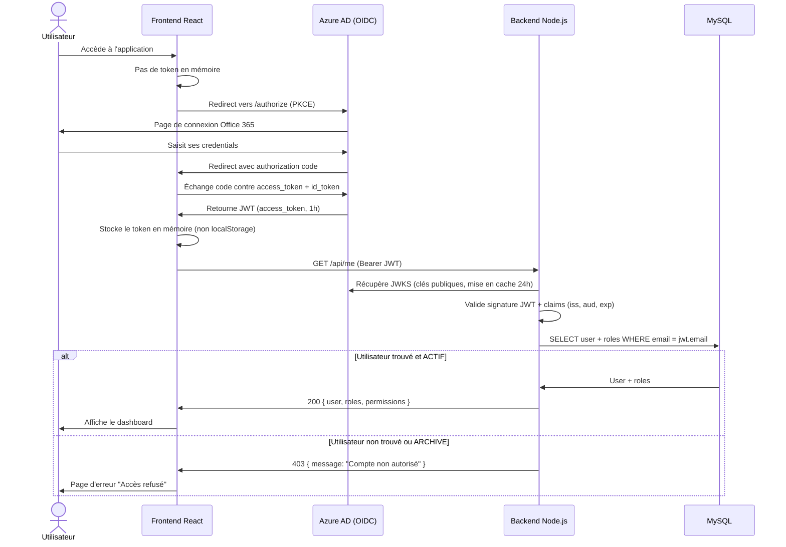

**Notes :**
- Le token Azure AD expire après 1h. MSAL.js gère le renouvellement silencieux via le refresh token.
- Les clés publiques JWKS sont mises en cache 24h côté backend pour éviter des appels répétés à Azure AD.
- En cas d'expiration mid-session, MSAL.js renouvelle le token silencieusement sans déconnexion.

---

## 2. Cycle d'import incrémental

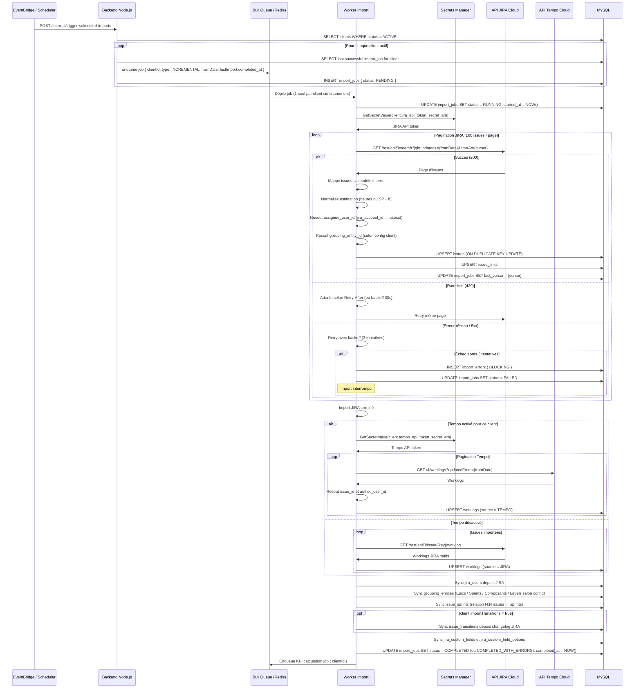

**Endpoint de référence pour la configuration KPI globale** :
- `GET /api/transitions/statuses/by-jira-connection/:jiraConnectionId`
- Usage : récupérer l'union des `fromStatus` / `toStatus` de tous les clients rattachés à une même connexion JIRA, sans imposer un client unique lors de la définition globale d'un KPI.
- Sécurité : l'API respecte le scope utilisateur ; un profil non admin ne voit que les clients autorisés sur cette connexion.
- Frontend Formula Editor : la connexion JIRA sélectionnée en mode global est mutualisée entre les sections `Périmètre` et `Filtres` pour garantir que les statuts de transition et les champs custom de référence reposent sur la même instance.
- Fallback global : si aucune connexion JIRA n'est choisie, le frontend lit `GET /api/settings` et utilise la clé `kpi.formula.statusInPeriod.globalFallbackStatuses` pour proposer une liste de statuts cibles configurable sans repasser par le code.
- Fenetre glissante `status_in_period` : la règle supporte `slidingWindowMonths` (entier, défaut `1`). Exemple : sur avril, `3` applique `changedAt` entre le 1er février et la fin d'avril, tout en stockant le résultat KPI sur la période d'avril.

---

## 3. Cycle de calcul KPI (après import)

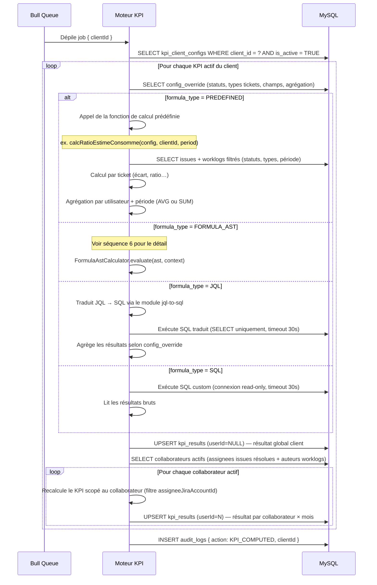

**Notes :**
- Le moteur KPI s'exécute en mode batch après chaque import réussi.
- **Deux niveaux de résultats** : global (`userId=NULL`) pour le dashboard client, et par collaborateur (`userId=N`) pour la vue collaborateurs.
- Les collaborateurs actifs sont détectés automatiquement (assignees d'issues résolues + auteurs de worklogs sur la période).
- Contrainte unique `(kpiClientConfigId, userId, periodType, periodStart)` → un seul résultat par KPI * collaborateur * mois.
- Si le calcul d'un KPI échoue, les autres KPI du client continuent. L'erreur est loggée et le résultat KPI concerné reste inchangé.
- Endpoint de consultation : `GET /api/dashboard/kpis-by-user?clientId=X&period=YYYY-MM`

---

## 4. Cycle de consultation du dashboard

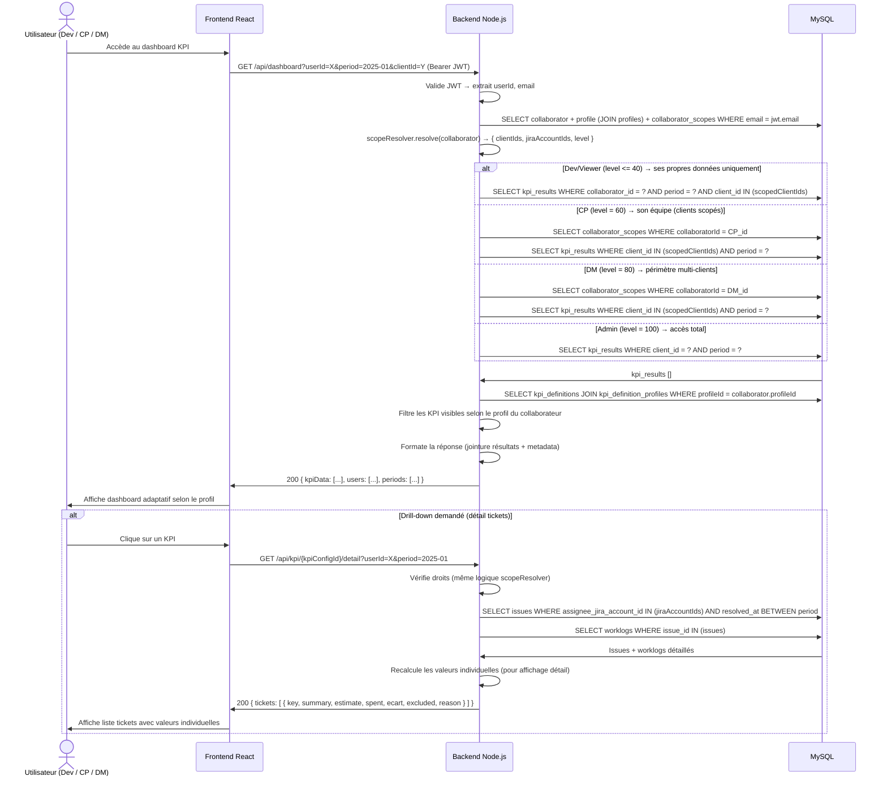

**Notes :**
- Les données affichées correspondent au dernier import réussi (indiqué par une mention "Dernière mise à jour : [date]" dans le dashboard).
- Si `is_obsolete = TRUE` sur certains résultats, le frontend affiche un bandeau d'avertissement "Données en cours de recalcul".
- Le drill-down recalcule les valeurs individuelles à la volée (par ticket) pour l'affichage, mais n'écrit pas en base.
- Le filtrage des KPI visibles utilise la table `kpi_definition_profiles` pour n'afficher que les KPI pertinents pour le profil.

---

## 12. Synchronisation sélective des utilisateurs Jira

> Statut: desactive temporairement (rollback des modifications du 27/03/2026).

Le flux de synchronisation sélective des utilisateurs Jira a été retiré temporairement du runtime.
Le mécanisme d'import principal reste disponible via les routes historiques d'import (`/api/imports/trigger`, `/api/imports/:id`, `/api/imports/:id/retry`).

---

## 5. Déclenchement d'un import backfill (Admin)

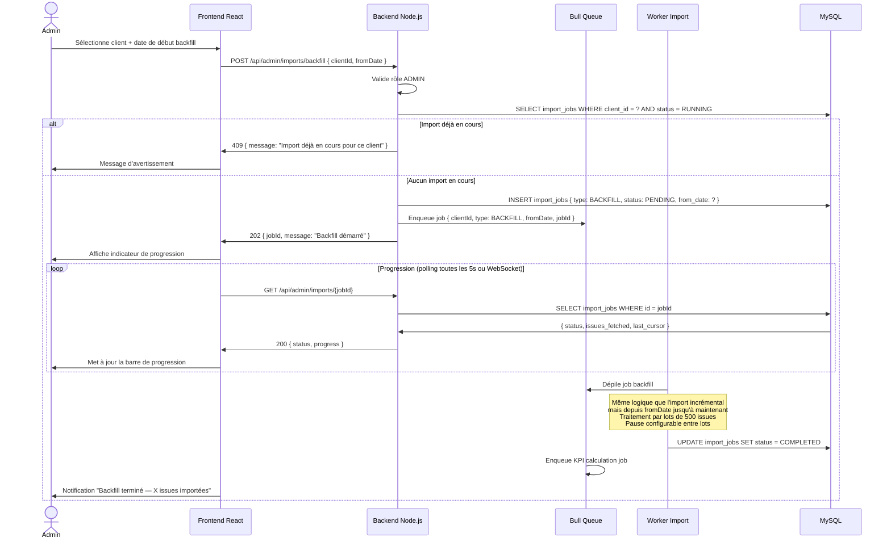

**Notes sur la reprise du backfill :**
- Après chaque lot, le curseur de pagination est sauvegardé dans `import_jobs.last_cursor`.
- Si le worker est interrompu (redémarrage du container, crash), le job reste en état `RUNNING` dans la queue Bull.
- Bull détecte le job "stalled" après un timeout configurable et le remet dans la file.
- Au redémarrage, le worker reprend depuis `last_cursor` (dernier lot validé), évitant de tout reimporter depuis le début.

---

## 6. KPI Formula AST — flux d'évaluation

> **Nouveau en v2.0**

Ce diagramme détaille le processus d'évaluation d'une formule de type `FORMULA_AST` par le `FormulaAstCalculator`.

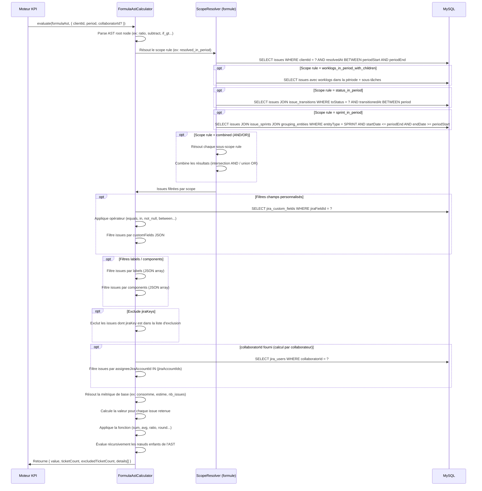

**Notes :**
- L'AST est un arbre JSON dont chaque noeud est une fonction ou une métrique.
- L'évaluation est récursive : un noeud `ratio` évalue ses deux enfants (numérateur, dénominateur) avant de calculer le rapport.
- Les filtres (scope, custom fields, labels, excludes) sont appliqués en cascade avant le calcul de la métrique.
- En mode **dry-run**, le même processus s'exécute mais le résultat n'est pas persisté en base. Cela permet de tester une formule sur des données réelles.
- En mode **validation**, seule la structure de l'AST est vérifiée (métriques existantes, fonctions valides, types compatibles) sans exécution.

---

## 7. Planification des calculs KPI (kpi_calc_schedules)

> **Nouveau en v2.0**

Le scheduler vérifie la table `kpi_calc_schedules` chaque minute et déclenche les calculs KPI selon la planification configurée.

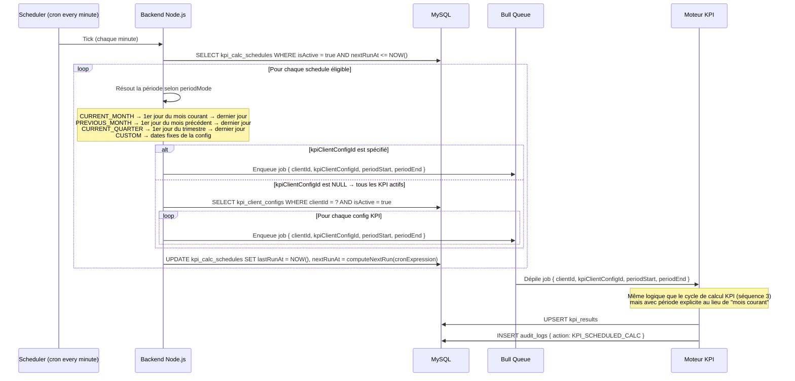

**Notes :**
- Le scheduler tourne indépendamment de l'import. Il permet de recalculer les KPI à intervalles réguliers sans attendre un nouvel import.
- `periodMode = PREVIOUS_MONTH` est utile pour le calcul en début de mois des KPI du mois écoulé (données complètes).
- Un même client peut avoir plusieurs schedules (ex: calcul quotidien du mois courant + calcul mensuel du mois précédent).

---

## 8. Synchronisation des champs personnalisés JIRA

> **Nouveau en v2.0**

La phase `syncCustomFields` fait partie de l'import et récupère les métadonnées des champs personnalisés JIRA ainsi que leurs options.

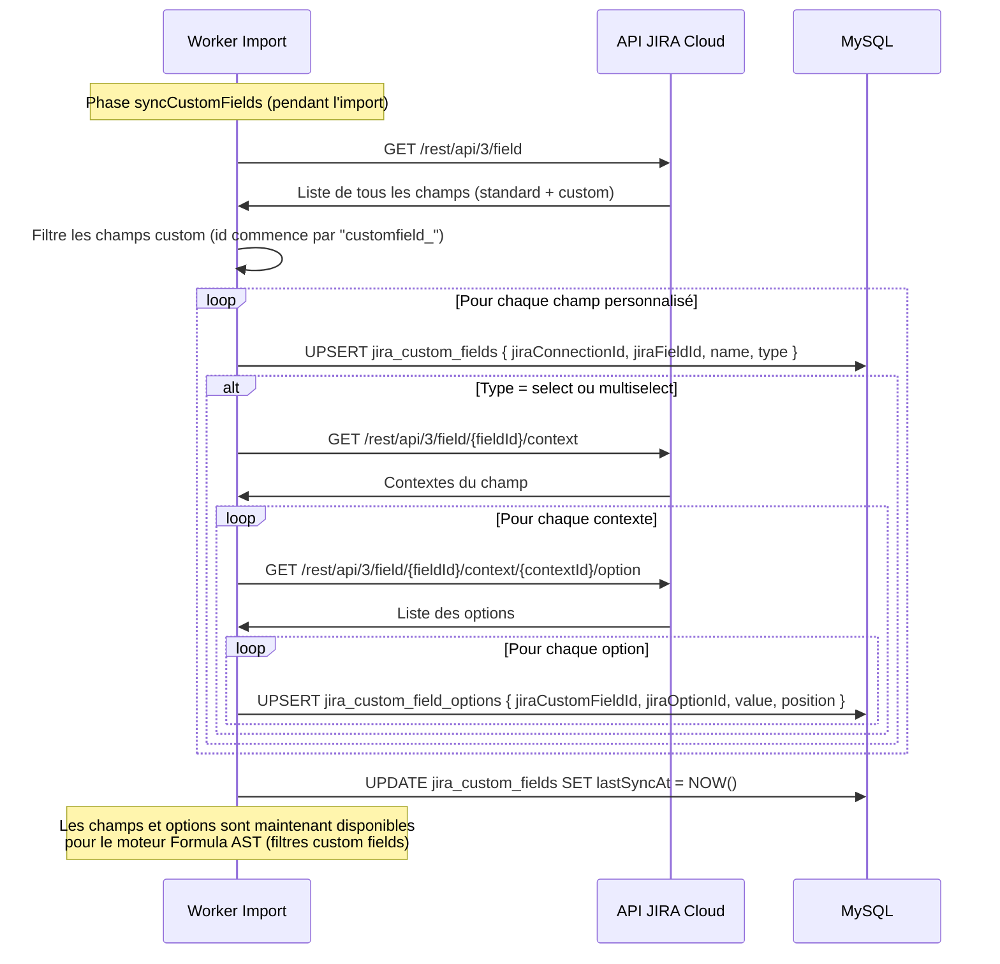

**Notes :**
- La synchronisation des champs personnalisés est effectuée à chaque import pour détecter les nouveaux champs ou les changements d'options.
- Les champs supprimés dans JIRA sont marqués `isActive = false` (soft delete) plutôt que supprimés, pour préserver la cohérence des formules AST existantes.
- Les options sont indexées par `(jiraCustomFieldId, jiraOptionId)` pour un accès rapide lors du filtrage.

---

## 9. Synchronisation des sprints et import des transitions

> **Nouveau en v2.0**

### 9.1 Synchronisation des sprints

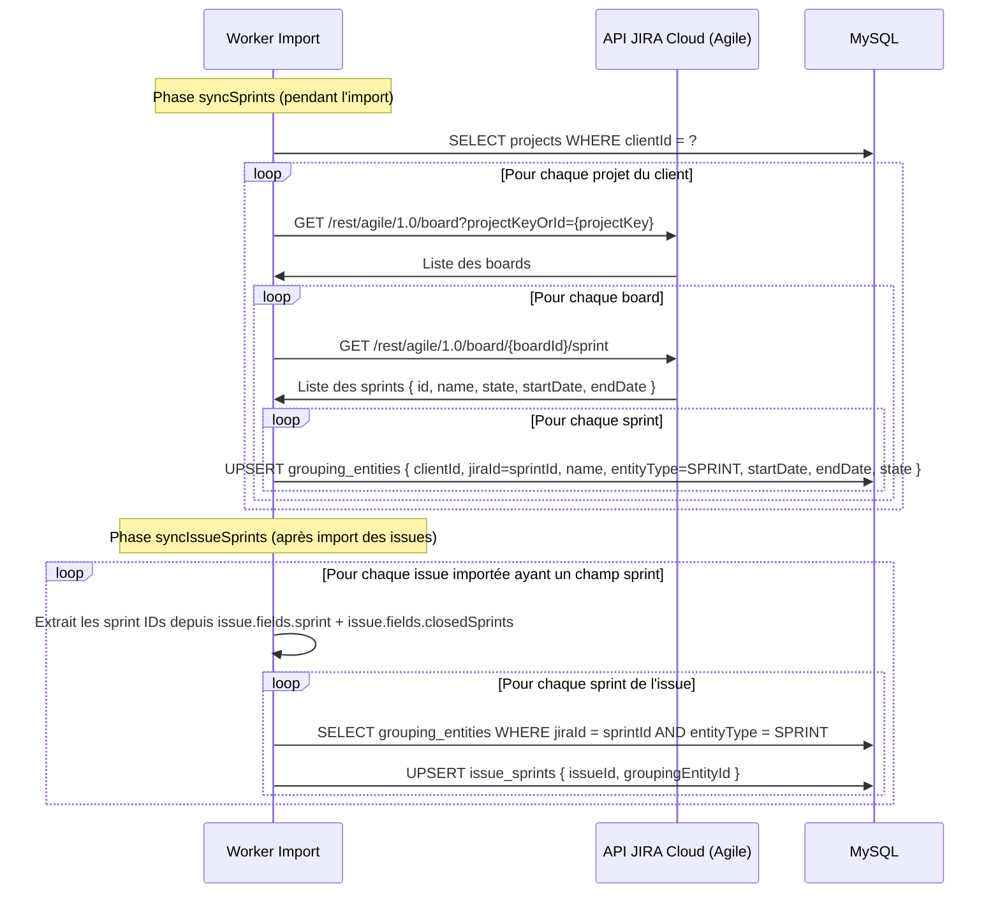

### 9.2 Import des transitions (changelog)

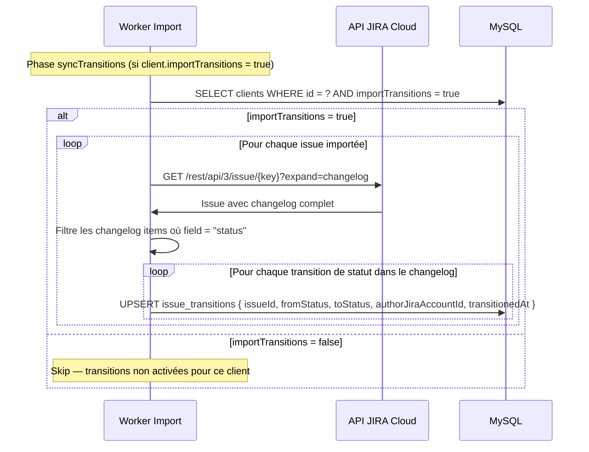

**Notes :**
- Les sprints sont rattachés aux issues via une relation N:N (`issue_sprints`) car une issue peut traverser plusieurs sprints (report, déplacement).
- Les données de sprint (startDate, endDate, state) sont stockées dans `grouping_entities` avec `entityType = SPRINT`.
- Les transitions sont utilisées par le scope rule `status_in_period` du moteur Formula AST pour déterminer si une issue était dans un statut donné pendant une période.
- L'import des transitions est optionnel (flag `clients.importTransitions`) car il nécessite un appel API supplémentaire par issue (changelog), ce qui peut ralentir l'import.

---

## 10. Résolution de scope par profil (scopeResolver)

## 11. Configuration des types de retours par projets Jira

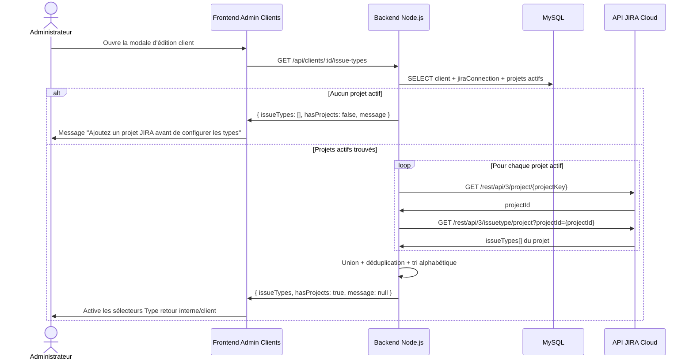

**Notes :**
- Les types retournés proviennent de l'union des types d'issues autorisés sur les projets Jira actifs du client.
- En création de client (avant ajout de projet), les sélecteurs de type retour restent désactivés et invitent l'admin à ajouter un projet d'abord.

> **Nouveau en v2.0**

Le `scopeResolver` est invoqué à chaque requête API pour déterminer les données accessibles au collaborateur authentifié.

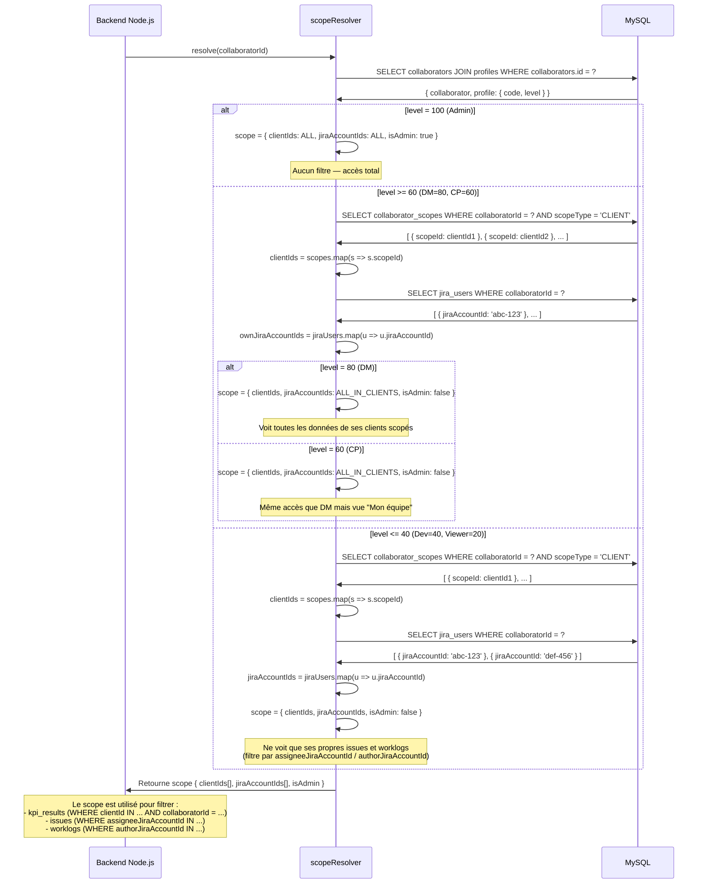

**Notes :**
- Le scopeResolver est un composant central invoqué par tous les endpoints API de consultation.
- Pour DM et CP, `jiraAccountIds = ALL_IN_CLIENTS` signifie qu'ils voient les données de tous les collaborateurs affectés à leurs clients, pas seulement les leurs.
- Pour Dev et Viewer, le filtre `jiraAccountIds` est strict : seules les issues assignées au collaborateur et les worklogs qu'il a saisis sont visibles.
- La différence entre CP et DM est principalement au niveau de l'affichage dashboard (vue "Mon équipe" vs vue multi-clients), pas au niveau du scope technique.
- Le scope est résolu une fois par requête et passé en paramètre aux services métier (KPI, issues, worklogs).

---

## 11. Mode debug KPI — flux de capture des traces SQL

Ce flux décrit comment un administrateur active le mode debug sur un KPI client, déclenche un recalcul, et consulte les traces SQL générées.

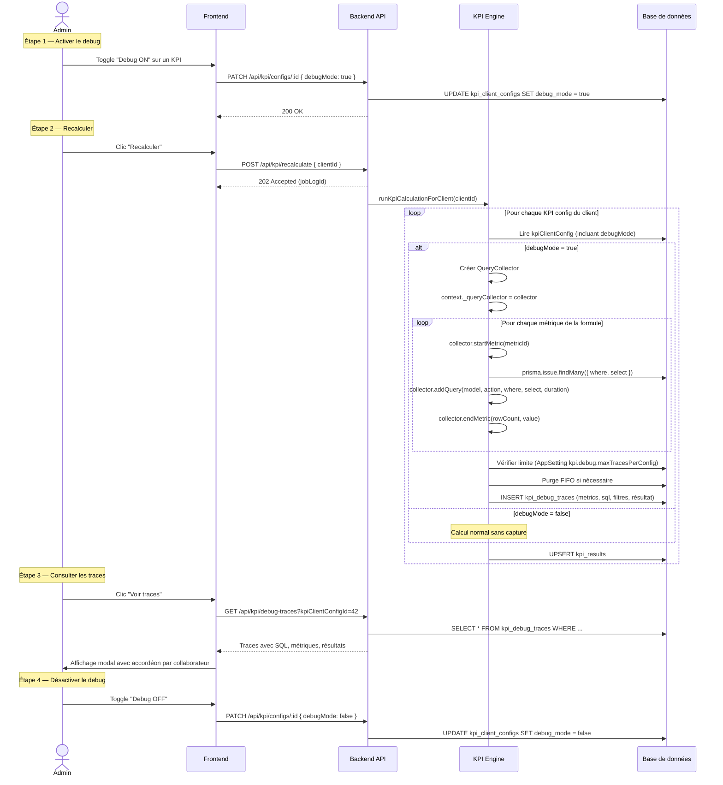

**Paramètres configurables (table `app_settings`)** :

| Clé | Défaut | Description |
|-----|--------|-------------|
| `kpi.debug.maxTracesPerConfig` | `10` | Nombre max de traces conservées par config KPI (FIFO) |
| `kpi.debug.purgeOnDisable` | `true` | Purger les traces quand debugMode passe à false |
| `kpi.debug.maxCollaboratorsTraced` | `0` | 0 = tous, sinon limite le nombre de collaborateurs tracés |
