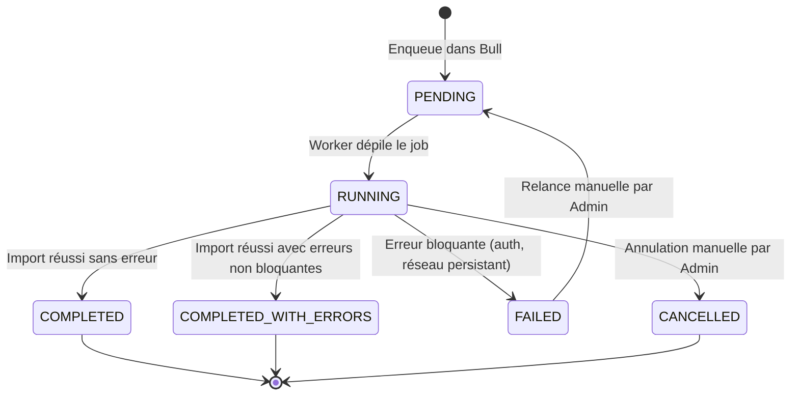

# Stratégie de gestion des erreurs — Architecture technique

> **Version** : 1.0
> **Étape** : 2 — Architecture technique
> **Statut** : À valider

---

## Sommaire

1. [Stratégie de retry et backoff](#1-stratégie-de-retry-et-backoff)
2. [États et transitions des jobs d'import](#2-états-et-transitions-des-jobs-dimport)
3. [Gestion des timeouts](#3-gestion-des-timeouts)
4. [Reprise sur incident (import)](#4-reprise-sur-incident-import)
5. [Gestion des doublons et de la cohérence](#5-gestion-des-doublons-et-de-la-cohérence)
6. [Erreurs applicatives (API REST)](#6-erreurs-applicatives-api-rest)
7. [Logging et observabilité](#7-logging-et-observabilité)
8. [Alertes et supervision](#8-alertes-et-supervision)

---

## 1. Stratégie de retry et backoff

### Import JIRA / Tempo

| Code HTTP | Signification | Stratégie |
|-----------|---------------|-----------|
| `429` | Rate limiting | Respecter l'en-tête `Retry-After`. Si absent : backoff 30s → 2min → 5min |
| `5xx` | Erreur serveur JIRA | Backoff exponentiel : 1min → 5min → 15min (3 tentatives max) |
| `401` / `403` | Auth invalide | Arrêt immédiat — pas de retry. Désactivation de l'instance + alerte critique |
| `404` | Ressource introuvable | Erreur non bloquante, ticket ignoré, loggé dans `import_errors` |
| Timeout réseau | Indisponibilité réseau | Même stratégie que `5xx` |

**Configuration (par client) :**
```json
{
  "maxRetries": 3,
  "retryDelaysMs": [60000, 300000, 900000],
  "rateLimitDefaultWaitMs": 30000,
  "requestTimeoutMs": 30000
}
```

### Moteur KPI (requêtes SQL custom)

- Timeout d'exécution : 30s (configurable par KPI)
- Pas de retry sur les erreurs SQL (erreur déterministe)
- En cas d'échec : KPI marqué comme non calculé pour la période, alerte Admin

---

## 2. États et transitions des jobs d'import



**Détail des statuts :**

| Statut | Description | Action possible |
|--------|-------------|-----------------|
| `PENDING` | En attente dans la file | Annuler |
| `RUNNING` | En cours d'exécution | Annuler (avec délai de grâce) |
| `COMPLETED` | Terminé avec succès | Consulter les stats |
| `COMPLETED_WITH_ERRORS` | Terminé avec des erreurs non bloquantes (tickets sans estimation, worklogs orphelins, etc.) | Consulter le détail des erreurs |
| `FAILED` | Échec total (erreur bloquante) | Relancer |
| `CANCELLED` | Annulé par l'Admin | Relancer |

---

## 3. Gestion des timeouts

### Timeouts configurés par composant

| Composant | Type de timeout | Valeur par défaut | Comportement si dépassé |
|-----------|----------------|-------------------|------------------------|
| Worker Import → JIRA API | Requête HTTP | 30s | Retry selon stratégie backoff |
| Worker Import → Tempo API | Requête HTTP | 30s | Retry selon stratégie backoff |
| Moteur KPI → SQL prédéfini | Requête SQL | 60s | Erreur non bloquante, KPI ignoré pour la période |
| Moteur KPI → SQL custom | Requête SQL | 30s | Erreur, KPI marqué invalide, alerte Admin |
| Moteur KPI → JQL traduit | Requête SQL | 60s | Erreur non bloquante |
| Backend API → Réponse client | HTTP Request | 30s | 504 Gateway Timeout |
| Job Bull → Stalled detection | Job processing | 5min | Job remis dans la file automatiquement |

### Gestion des jobs "stalled" (Bull)

Bull détecte automatiquement les jobs dont l'exécution s'est interrompue sans mise à jour de heartbeat. La configuration recommandée :

```js
// Configuration de la queue Bull
const importQueue = new Bull('imports', {
  redis: redisConfig,
  settings: {
    stalledInterval: 30000,   // Vérification des jobs stalled toutes les 30s
    maxStalledCount: 2,       // Nombre max de redémarrages avant marquage FAILED
  },
  defaultJobOptions: {
    attempts: 3,
    backoff: { type: 'exponential', delay: 60000 },
    removeOnComplete: false,  // Conserver l'historique
    removeOnFail: false,
  }
});
```

---

## 4. Reprise sur incident (import)

### Curseur de pagination

Le champ `import_jobs.last_cursor` stocke le curseur de pagination JIRA après chaque lot traité avec succès :

```json
{
  "jira_start_at": 1500,
  "jira_total": 3200,
  "tempo_last_worklog_id": "456789",
  "phase": "ISSUES"
}
```

**Phases de l'import :**
1. `ISSUES` — Import des tickets JIRA
2. `WORKLOGS` — Import des worklogs (JIRA ou Tempo)
3. `MEMBERS` — Synchronisation des membres de projet
4. `GROUPING_ENTITIES` — Synchronisation des entités de regroupement

En cas de reprise, le worker repart depuis la phase et le curseur enregistrés.

### Scénarios de reprise

| Incident | Détection | Reprise |
|----------|-----------|---------|
| Container ECS redémarré | Bull détecte job stalled | Reprise automatique depuis `last_cursor` |
| RDS temporairement indisponible | Exception DB dans le worker | Retry Bull (3 tentatives) → si échec → FAILED |
| JIRA API temporairement down | Retry épuisé | Job FAILED → relance manuelle Admin |
| Redis down | Bull inaccessible | Jobs planifiés manqués → recréation manuelle |
| Backfill très long interrompu | Job stalled Bull | Reprise automatique depuis le curseur |

### Protection contre les imports parallèles

Bull gère la concurrence au niveau de la queue. La configuration recommandée :

```js
// Un seul worker actif par queue de client
const clientQueue = new Bull(`import-client-${clientId}`, redisConfig);
clientQueue.process(1, importWorkerHandler); // concurrency = 1
```

Une queue dédiée par client garantit qu'un seul import s'exécute simultanément pour un client donné.

---

## 5. Gestion des doublons et de la cohérence

### Upsert systématique

Tous les upserts utilisent `ON DUPLICATE KEY UPDATE` sur les clés métier uniques :

```sql
-- Issues : clé unique = (client_id, jira_id)
INSERT INTO issues (...) VALUES (...)
ON DUPLICATE KEY UPDATE
  summary = VALUES(summary),
  current_status = VALUES(current_status),
  assignee_user_id = VALUES(assignee_user_id),
  time_spent_seconds = VALUES(time_spent_seconds),
  jira_updated_at = VALUES(jira_updated_at),
  imported_at = NOW();

-- Worklogs JIRA : clé unique = jira_worklog_id
-- Worklogs Tempo : clé unique = tempo_worklog_id
```

### Cohérence des références

| Référence | Stratégie si introuvable |
|-----------|--------------------------|
| `assignee_user_id` (JIRA account → user) | Stocke `assignee_jira_account_id` brut. Résolution tentée à l'import suivant. Worklog non bloquant. |
| `grouping_entity_id` (Epic/Composant/Label) | Null temporaire. Résolu une fois l'entité de regroupement importée (ordre d'import : grouping_entities avant issues). |
| `author_user_id` sur worklog | Null si inconnu. Worklog conservé mais non utilisé dans les KPI. |
| Ticket parent (`parent_issue_id`) | Import du ticket parent déclenché si absent. Si échec, `parent_issue_id` reste null. |

### Ordre d'import dans un cycle

Pour garantir la cohérence des références :

1. **Membres de projet** → garantit que les users sont créés avant d'être référencés
2. **Entités de regroupement** (Epics, Composants, Labels) → avant les issues
3. **Issues** (tickets) → avec résolution des FK vers users et grouping_entities
4. **Sous-tâches et liens** → après les issues parentes
5. **Worklogs** → après les issues

---

## 6. Erreurs applicatives (API REST)

### Format des erreurs

Toutes les erreurs de l'API suivent un format JSON normalisé :

```json
{
  "error": {
    "code": "FORBIDDEN",
    "message": "Vous n'avez pas les droits nécessaires pour accéder à cette ressource.",
    "details": null,
    "requestId": "req_abc123xyz"
  }
}
```

### Codes d'erreur applicatifs

| Code HTTP | Code applicatif | Situation |
|-----------|----------------|-----------|
| `400` | `VALIDATION_ERROR` | Corps de requête invalide (Zod) |
| `401` | `UNAUTHORIZED` | Token JWT absent ou invalide |
| `403` | `FORBIDDEN` | Token valide mais droits insuffisants |
| `404` | `NOT_FOUND` | Ressource introuvable |
| `409` | `CONFLICT` | Import déjà en cours, doublon de configuration |
| `422` | `UNPROCESSABLE` | Données sémantiquement invalides (ex. : JQL invalide) |
| `429` | `RATE_LIMITED` | Trop de requêtes (si rate limiting activé côté backend) |
| `500` | `INTERNAL_ERROR` | Erreur interne non gérée |
| `503` | `SERVICE_UNAVAILABLE` | Dépendance indisponible (Redis, RDS) |

### Middleware d'erreur global (Express)

```ts
// Gestion centralisée des erreurs non capturées
app.use((err: Error, req: Request, res: Response, next: NextFunction) => {
  const requestId = req.headers['x-request-id'] ?? generateId();
  logger.error({ err, requestId, path: req.path });

  if (err instanceof AppError) {
    return res.status(err.statusCode).json({ error: err.toJSON() });
  }

  // Erreur non gérée → ne pas exposer les détails en production
  return res.status(500).json({
    error: { code: 'INTERNAL_ERROR', message: 'Une erreur interne est survenue.', requestId }
  });
});
```

---

## 7. Logging et observabilité

### Structure des logs (JSON — Winston)

```json
{
  "timestamp": "2025-01-15T02:14:32.123Z",
  "level": "info",
  "service": "import-worker",
  "clientId": 5,
  "importJobId": 142,
  "phase": "ISSUES",
  "message": "Lot importé avec succès",
  "issuesFetched": 100,
  "issuesUpserted": 98,
  "cursor": 1400,
  "durationMs": 2340
}
```

### Niveaux de log

| Niveau | Utilisation |
|--------|-------------|
| `DEBUG` | Détails techniques (désactivé en prod) |
| `INFO` | Événements normaux (début/fin import, KPI calculés, connexions SSO) |
| `WARN` | Situations anormales non bloquantes (ticket sans estimation, worklog orphelin) |
| `ERROR` | Erreurs bloquantes (échec import, token invalide, timeout critique) |

### Métriques CloudWatch recommandées

| Métrique | Description | Alarme si |
|----------|-------------|-----------|
| `ImportDuration` | Durée d'un import par client | > 30min |
| `ImportErrorCount` | Erreurs bloquantes par import | > 0 |
| `KpiComputeFailures` | KPI non calculés | > 0 |
| `ApiLatencyP99` | Latence 99e percentile API | > 2s |
| `JobQueueDepth` | Nombre de jobs en attente | > 50 |
| `StalledJobs` | Jobs stalled détectés par Bull | > 0 |

---

## 8. Alertes et supervision

### Alertes critiques (notification immédiate)

| Déclencheur | Sévérité | Destinataire |
|-------------|----------|-------------|
| Token JIRA ou Tempo invalide (401/403) | CRITICAL | Admin (in-app + email) |
| Import FAILED après 3 retries | HIGH | Admin (in-app) |
| Job stalled non récupéré | HIGH | Admin (in-app) |
| Espace disque RDS > 80% | HIGH | Admin (CloudWatch → email) |
| Erreur Redis (connexion impossible) | CRITICAL | Admin (CloudWatch → email) |

### Alertes non bloquantes (tableau de bord Admin)

| Déclencheur | Affichage |
|-------------|-----------|
| `COMPLETED_WITH_ERRORS` (erreurs non bloquantes) | Badge orange sur l'import dans l'historique |
| KPI avec `is_obsolete = TRUE` | Bandeau "Données en cours de recalcul" dans le dashboard |
| Collaborateur `SANS_SAISIE` | Compteur dans le tableau de bord Admin |
| Champ de mapping introuvable dans l'instance JIRA | Alerte de configuration dans l'écran client |

### Tableau de bord de santé (écran Admin)

L'écran de supervision Admin affiche en temps réel :

```
┌─────────────────────────────────────────────────────────────┐
│  Santé du système — Dernière mise à jour : il y a 30s       │
├─────────────────┬──────────────────┬────────────┬───────────┤
│ Client          │ Dernier import   │ Statut     │ Prochain  │
├─────────────────┼──────────────────┼────────────┼───────────┤
│ Client A        │ 15/01 02:14      │ ✅ OK      │ 16/01 02h │
│ Client B        │ 14/01 02:08      │ ⚠️ Erreurs │ 15/01 02h │
│ Client C        │ ─                │ ❌ Échec   │ Manuel    │
└─────────────────┴──────────────────┴────────────┴───────────┘

Alertes actives :
  ❌ [Client C] Token JIRA invalide — Action requise
  ⚠️ [Client B] 14 tickets sans estimation (import du 14/01)

Collaborateurs sans saisie (> 3 jours) : 7  [Voir la liste]
```
